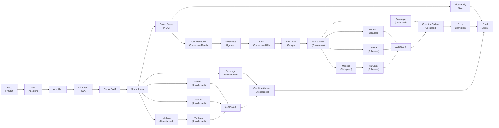

# LSC CEBPA MRD workflow description

## Introduction

&emsp;This repository describes the bioinformatics workflow for analysing MRD samples sequenced using a single gene amplicon based assay for **CEBPA**. Sample libraries were sequenced on a NextSeq platform using 2x150 bp reads. 


&emsp;Reads are preprocessed to remove adapters and low quality bases, followed by alignment to the human genome (build hg19). Reads originating from the same UMI family were collapsed to obtain consensus reads using the fgbio tools (https://github.com/fulcrumgenomics/fgbio) .  Variant calling is performed using multiple callers and results are combined and annotated. A site and mutation-specific background error model is applied to distinguish true variants from sequencing noise. Detailed steps to generate the error model are described in the `error_model.md`

---
## Pipeline summary



## Pipeline structure
This repository loosely follows the nfcore pipeline structure.
```
assets/			            # Folder containing reference files
bin/			            # Folder with scripts called in the pipeline
modules/		            # Folder containing individual process descriptions
sequences/		            # Input sequences 
cebpa_mrd_amplicon.nf		# Nextflow file defining the pipeline 
nextflow.config	            # File describing input parameters and computing resources for individual processes
```
## References
Execution of this pipeline requires certain reference files. These need to be downloaded and the following parameters need to be modified in the `params` section of the `nextflow.config` before executing the workflow : 
- *genome* = Complete path to the human genome fasta file(hg19_all.fasta). Please ensure that the BWA index files (hg19_all.fasta.fai, hg19_all.fasta.amb, hg19_all.fasta.ann, hg19_all.fasta.bwt, hg19_all.fasta.pac, hg19_all.fasta.sa) are also present in the same genome folder. The assests folder currently contains placeholder genome and index files.

- *annovar_humandb* = Complete path to the humandb database folder for [ANNOVAR](https://annovar.openbioinformatics.org/en/latest/user-guide/startup/ "annovar site")

- *gen_ref*	= Complete path to the gene_fullxref.txt file as downloaded from the [ANNOVAR](https://annovar.openbioinformatics.org/en/latest/user-guide/startup/ "annovar site") site

- *bedfile* = This file needs to be updated based on the amplicons used for the assay

- *outdir* = Location to write the output folder

## Usage
1. Clone the repository using ```https://github.com/patkarlab/LSC_CEBPA_MRD.git```

2. Enter the directory ```cd LSC_CEBPA_MRD```  

3. Download the reference as mentioned in the Reference section above.  

4. Transfer the sample input files `*.fastq.gz` inside the `sequences/` folder.

5. Modify the `samplesheet.csv`. The sample_ids, without the file extension, should be mentioned in samplesheet in the following format - <br>
sample1  
sample2  
sample3  
Please remove any empty lines in the samplesheet before running the pipeline.

3. To launch the pipeline, use the following command
```bash
nextflow -C nextflow.config run cebpa_mrd_amplicon.nf -entry CEBPA_MRD -bg -profile docker -resume 
```

## Output

Samplewise output folders are written to the folder name mentioned in the `outdir` param in the config file.  
Individual output folder contains:

- **Samplename_cons_sortd.bam** : Coordinate-sorted BAM file of consensus reads generated after UMI collapsing.

- **Samplename_cons_sortd.bam.bai** : Index file for the consensus BAM.

- **Samplename.uncollaps.bam** : BAM file containing uncollapsed reads.

- **Samplename.uncollaps.bam.bai** : Index file for the uncollapsed BAM.

- **Samplename_family.png** : Plot showing family size distribution of UMI groups.

- **Samplename_uncollaps.xlsx** : File containing combined and annotated variants from uncollapsed reads.

- **Samplename_ErrorCorrected.xlsx** : File containing annotated SNPs after applying the error model.  
  Variants with **Pvalue < 0.005** are selected for analysis.  
  The column titled **background** represents the % background error, calculated as:  
  (mean error rate + (3 × standard deviation)) × 100

## Citation
If you use this pipeline in your research, please cite:
```
Leukemic stem cell MRD refines relapse-risk beyond conventional FCM and NGS-based approaches in intensively treated AML. 2026
```

## Contact
[Patkarlab](https://github.com/patkarlab)